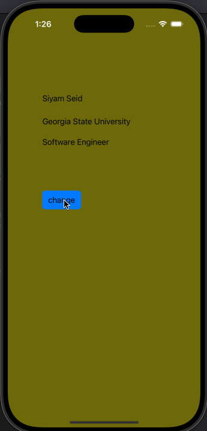

# Prework - *Color Switch*

Submitted by: **Siyam Seid**

**Color Switch** is an app that changes the app's background to a rondom color every time the button is clicked.

Time spent: **1** hours spent in total

## Required Features

The following **required** functionality is completed:

- [X] Users are see a screen with three labels and a button
- [X] Tapping the button changes the screen color to a random color
 
## Video Walkthrough 

.

## App Brainstorming (Step 4)

1. Duolingo
    •    Gamified learning with streaks and rewards
    •    Fun notifications that keep me motivated

2. Spotify
    •    Personalized playlists 
    •    Ability to download songs for offline listening
    
3. YouTube
    •    Ability to play video while hovering on it
    •    Adjustable playback speed to learn faster
    
## Notes

Describe any challenges encountered while building the app.
- Running an app on stimulator for the first time.

## License

    Copyright [yyyy] [name of copyright owner]

    Licensed under the Apache License, Version 2.0 (the "License");
    you may not use this file except in compliance with the License.
    You may obtain a copy of the License at

        http://www.apache.org/licenses/LICENSE-2.0

    Unless required by applicable law or agreed to in writing, software
    distributed under the License is distributed on an "AS IS" BASIS,
    WITHOUT WARRANTIES OR CONDITIONS OF ANY KIND, either express or implied.
    See the License for the specific language governing permissions and
    limitations under the License.
